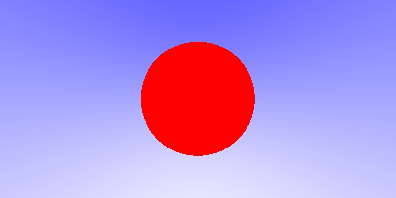
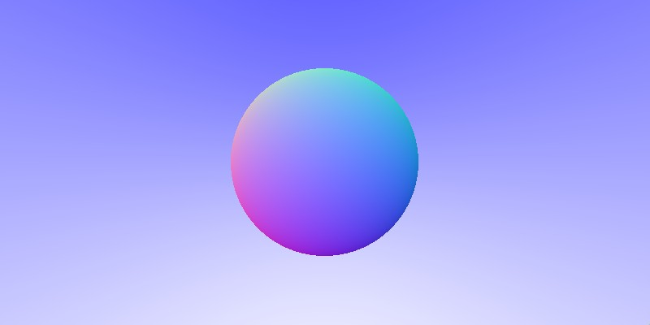

## Raytracer

Raytracer implementation in **`Rust`** based on the tutorial: [Ray Tracing in One Weekend.](https://raytracing.github.io/books/RayTracingInOneWeekend.html)

### Test generated image

### write image test

### render bacgkground

### hitting a sphere

### added normals

