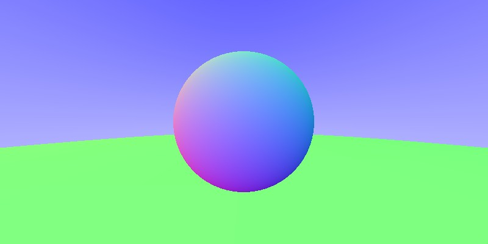
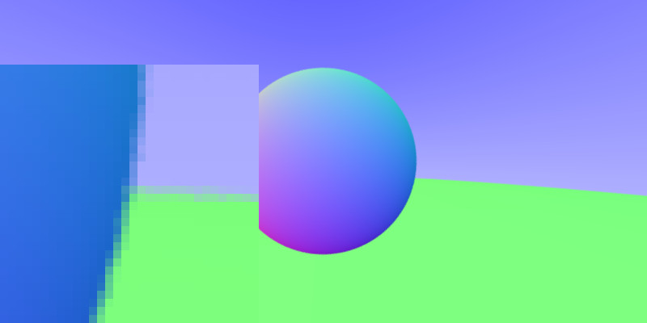
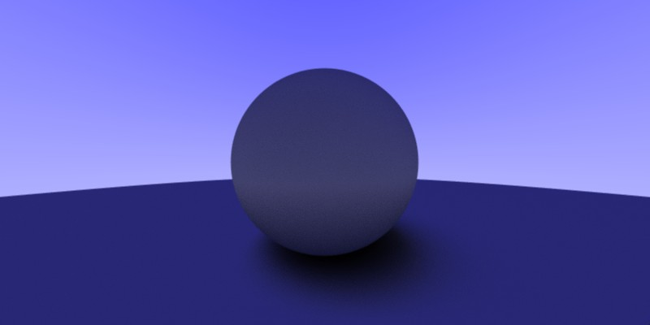
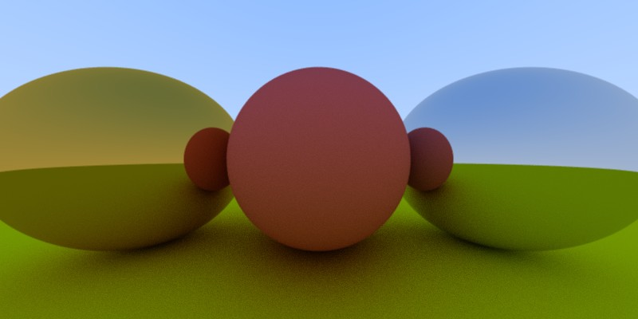
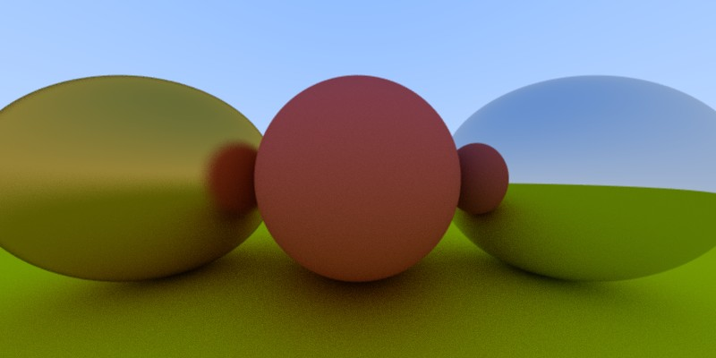

## Raytracer

A **Raytracer** implementation in **`Rust`** based on the tutorial: [Ray Tracing in One Weekend.](https://raytracing.github.io/books/RayTracingInOneWeekend.html)  
Also used [snarkyboojum's video tutorial series](https://www.youtube.com/watch?v=_5hD0gxRzzg) for guideance.

### Test generated image

### write image test

### render bacgkground

### hitting a sphere

### added normals

### Hittable trait & multiple objects

### Aliased image without randomised rays

### Antialiasing with randomised rays

### A simple diffuse material

### Diffuse, metal & reflection
- ray per pixel: 128
- *max colour calc recursion: 512*
- **Pentium Silver N5000, 4 Gb => ~ 20.0 secs**

### Added fuzziness to metal

